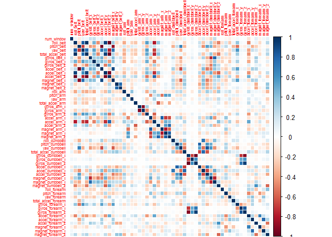

Background
----------

Using devices such as Jawbone Up, Nike FuelBand, and Fitbit it is now possible to collect a large amount of data about personal activity relatively inexpensively. These type of devices are part of the quantified self movement - a group of enthusiasts who take measurements about themselves regularly to improve their health, to find patterns in their behavior, or because they are tech geeks. One thing that people regularly do is quantify how much of a particular activity they do, but they rarely quantify how well they do it. In this project, our goal will be to use data from accelerometers on the belt, forearm, arm, and dumbell of 6 participants. They were asked to perform barbell lifts correctly and incorrectly in 5 different ways. More information is available from the website here: [<http://groupware.les.inf.puc-rio.br/har>](http://groupware.les.inf.puc-rio.br/har) (see the section on the Weight Lifting Exercise Dataset).  

Data 
------------

The training data for this project is available here:  
[<https://d396qusza40orc.cloudfront.net/predmachlearn/pml-training.csv>](https://d396qusza40orc.cloudfront.net/predmachlearn/pml-training.csv)  
The test data is available here:  
[<https://d396qusza40orc.cloudfront.net/predmachlearn/pml-testing.csv>](https://d396qusza40orc.cloudfront.net/predmachlearn/pml-testing.csv)  
The data for this project comes from this original source: [<http://groupware.les.inf.puc-rio.br/har>](http://groupware.les.inf.puc-rio.br/har). If you use the document you create for this class for any purpose please cite them as they have been very generous in allowing their data to be used for this kind of assignment.  

Prepare the DataSets
------------
1. Load all the librarys necesary to run the project.

```r
library(caret)
```

```
## Loading required package: lattice
## Loading required package: ggplot2
```

```r
library(ggplot2)
library(corrplot)
library(randomForest)
```
2. Reading Data

```r
setwd("C:/Users/angela/Downloads")

trainRaw <- read.csv("pml-training.csv",na.strings = c("NA", ""))

testRaw <- read.csv("pml-testing.csv",na.strings = c("NA", ""))

3. Cleaning Data

We would to drop observations with missing values as well as variables that dont contibute to the analysis .  

``` r
NZVdata <- nearZeroVar(trainRaw, saveMetrics = TRUE)
``` r
training0 <- trainRaw[, !NZVdata$nzv]
testing0 <- testRaw[, !NZVdata$nzv]
``` r
rm(trainRaw)
rm(testRaw)
rm(NZVdata)
```

Removing some columns of the dataset that do not contribute much to the accelerometer measurements.

``` r
regex <- grepl("^X|timestamp|user_name", names(training01))
training <- training0[, !regex]
testing <- testing0[, !regex]
rm(regex)
rm(training0)
rm(testing0)

Removing columns that contain `NA's`.

``` r
cond <- (colSums(is.na(training)) == 0)
training <- training[, cond]
testing <- testing[, cond]
rm(cond)
```

After cleaning, the training data set contains 19622 observations and 54 variables, while the testing data set contains 20 observations and 54 variables.

Correlation Matrix of Columns in the Training Data set.

``` r
corrplot(cor(training[, -length(names(training))]), method = "color", tl.cex = 0.5)
```



The graph shows us nice information to implement a Random Forest Study.

Model Building
-------------------------

we split the cleaned training set into a pure training data set (70%) and a validation data set (30%). 
``` r
set.seed(56789) # For reproducibile purpose
inTrain <- createDataPartition(training$classe, p = 0.70, list = FALSE)
validation <- training[-inTrain, ]
training <- training[inTrain, ]
rm(inTrain)
```

The Dataset now consists of 54 variables with the observations divided as following:  
1. Training Data: 13737 observations.  
2. Validation Data: 5885 observations.  
3. Testing Data: 20 observations.  


``` r
modelRF <- train(classe ~ ., data = training, method = "rf", trControl = trainControl(method = "cv", 5), ntree = 250)
modelRF
```

    ## Random Forest 
    ## 
    ## 13737 samples
    ##    53 predictor
    ##     5 classes: 'A', 'B', 'C', 'D', 'E' 
    ## 
    ## No pre-processing
    ## Resampling: Cross-Validated (5 fold) 
    ## 
    ## Summary of sample sizes: 10989, 10988, 10991, 10990, 10990 
    ## 
    ## Resampling results across tuning parameters:
    ## 
    ##   mtry  Accuracy   Kappa      Accuracy SD   Kappa SD   
    ##    2    0.9941762  0.9926331  0.0015235050  0.001927342
    ##   27    0.9971607  0.9964086  0.0009432244  0.001192905
    ##   53    0.9948309  0.9934612  0.0018827897  0.002381830
    ## 
    ## Accuracy was used to select the optimal model using  the largest value.
    ## The final value used for the model was mtry = 27.

Next, we estimate the performance of the model on the validation data set.

``` r
predictRF <- predict(modelRF, validation)
confusionMatrix(validation$classe, predictRF)
```

    ## Confusion Matrix and Statistics
    ## 
    ##           Reference
    ## Prediction    A    B    C    D    E
    ##          A 1674    0    0    0    0
    ##          B    0 1139    0    0    0
    ##          C    0    1 1022    3    0
    ##          D    0    0    2  962    0
    ##          E    0    0    0    1 1081
    ## 
    ## Overall Statistics
    ##                                           
    ##                Accuracy : 0.9988          
    ##                  95% CI : (0.9976, 0.9995)
    ##     No Information Rate : 0.2845          
    ##     P-Value [Acc > NIR] : < 2.2e-16       
    ##                                           
    ##                   Kappa : 0.9985          
    ##  Mcnemar's Test P-Value : NA              
    ## 
    ## Statistics by Class:
    ## 
    ##                      Class: A Class: B Class: C Class: D Class: E
    ## Sensitivity            1.0000   0.9991   0.9980   0.9959   1.0000
    ## Specificity            1.0000   1.0000   0.9992   0.9996   0.9998
    ## Pos Pred Value         1.0000   1.0000   0.9961   0.9979   0.9991
    ## Neg Pred Value         1.0000   0.9998   0.9996   0.9992   1.0000
    ## Prevalence             0.2845   0.1937   0.1740   0.1641   0.1837
    ## Detection Rate         0.2845   0.1935   0.1737   0.1635   0.1837
    ## Detection Prevalence   0.2845   0.1935   0.1743   0.1638   0.1839
    ## Balanced Accuracy      1.0000   0.9996   0.9986   0.9977   0.9999

``` r
accuracy <- postResample(predictRF, validation$classe)
ose <- 1 - as.numeric(confusionMatrix(validation$classe, predictRF)$overall[1])
rm(predictRF)
```

As shown above, the Estimated Accuracy of the Random Forest Model is 99.8810535% and the Estimated Out-of-Sample Error is 0.1189465%.  We got a very nice high level of accuracy.
